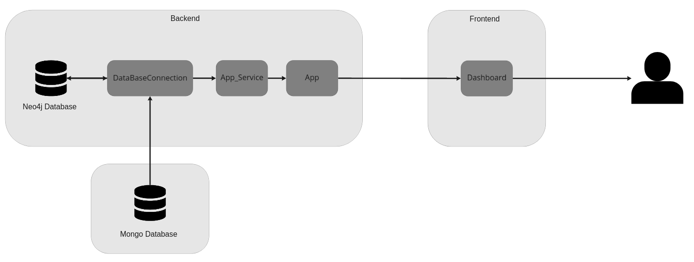
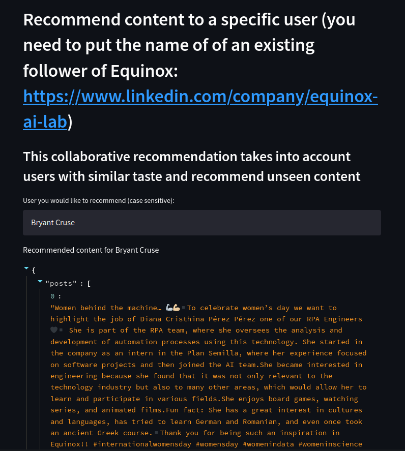
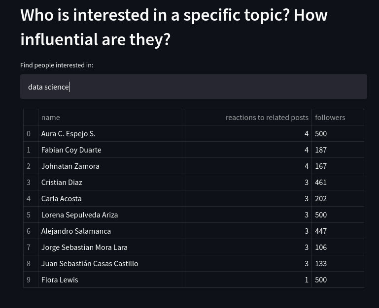
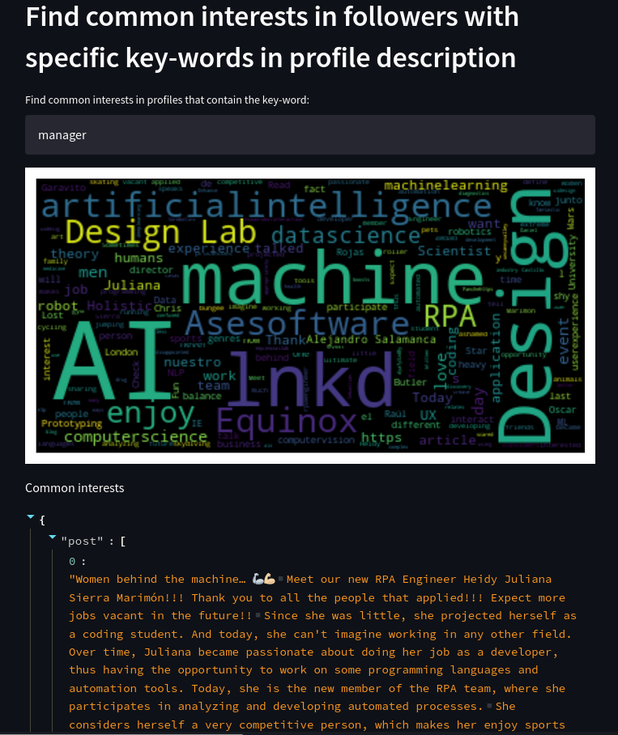
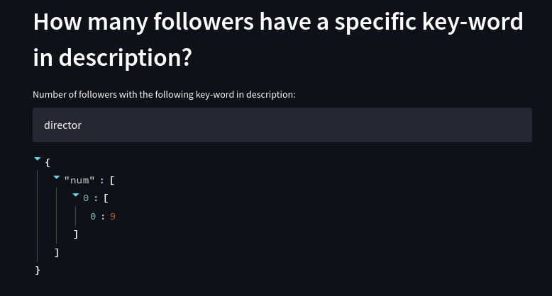
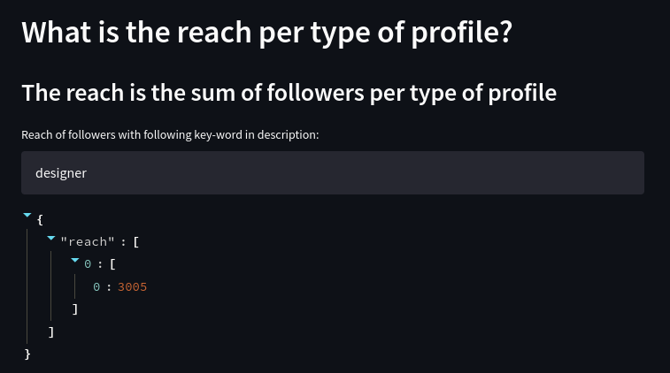
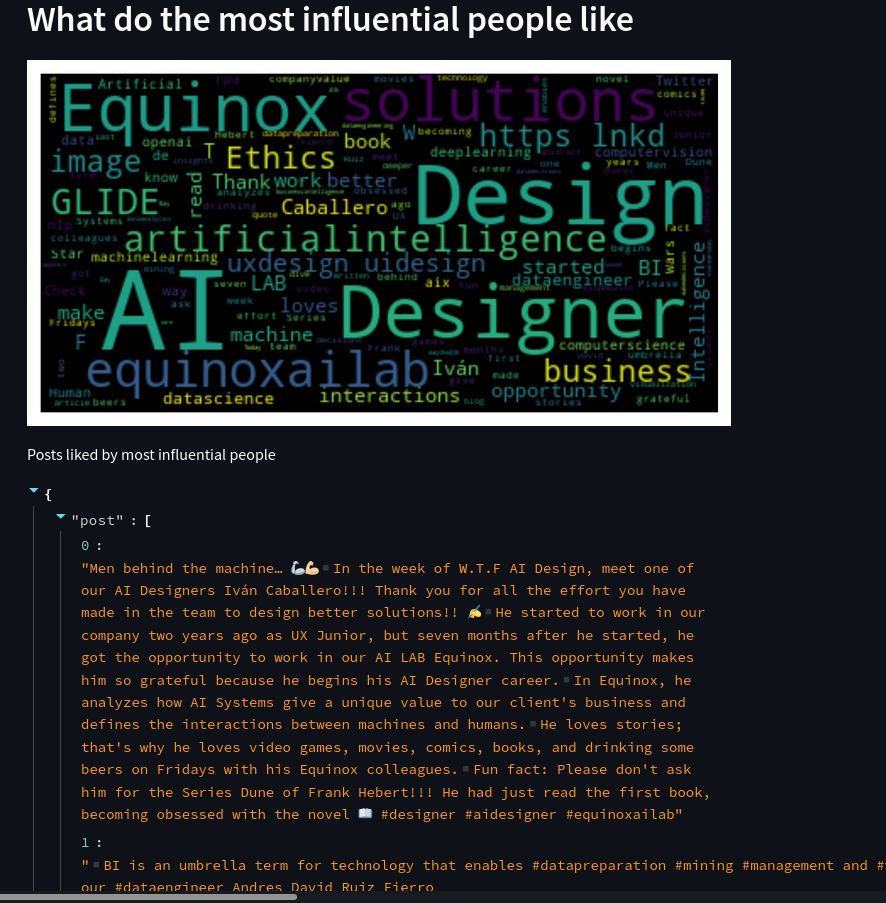

# Project - Alejandro Salamanca

The project is intended as a tool for social media analytics. It focuses on analyzing LinkedIn posts and followers of the company Equinox AI & Data Lab https://www.linkedin.com/company/equinox-ai-lab. 

The tool's objective is to answer some relevant questions about the network of followers and content published by the company.

The questions are answered by exploiting a modelled graph where there are two types of nodes: the nodes that represent followers and the nodes that represent content (posts). The connection between the nodes is given by the reactions of followers to posts. This way, we can answer some interesting questions about the network.

## Architecture

The application's architecture is thought to be so the backend and frontend can be decoupled and deployed in different containers or VMs. 

The backend is responsible for: 
- Connecting to the Azure Cosmos DB (MongoDB) where the LinkedIn information is stored.
- Storing the specific information of content and followers in a graph inside a Neo4j database.
- Querying the Neo4j Database.
- Exposing results of queries as REST services with Flask.

The frontend is responsible for:
- Making the HTTP requests to the backend server.
- Deploying the results in a dashboard with the streamlit framework.

In the config file is the URL to connect to the Cosmos DB.

## Assumptions and Restrictions

For this application to work, some assumptions need to be considered.

- All the packages in the requirements.txt file need to be installed.
- Although the application was built to decouple the frontend and backend, the current implementation is built to run locally.
- Neo4j is already installed, and the default database 'neo4j' will be used to create the graph and make the queries.
- The connection to the Neo4j database must be changed in the config file for the application to work.
- For Streamlit to work correctly, run the command pip install -U click==8
- The application is meant to be deployed once, meaning that it will build the graph database every time it starts again. If the database has previous information, the application will crash. To avoid this, after finishing testing the app, erase all info in the database with the following command in the cypher-shell: match (p:Person),(p1:Post) detach delete p,p1;

## Execute the application

To start the application, follow these steps:

1. Install Neo4j: https://www.digitalocean.com/community/tutorials/how-to-install-and-configure-neo4j-on-ubuntu-20-04
2. On the same machine, install all the requirements for the backend to work (Back/requirements.txt).
3. In the same machine, install all requirements for the frontend to work (Front/requirements.txt)
4. Open a terminal, go to the Back folder and start the backend with the instruction: FLASK_APP=App.py flask run
5. Be sure that the endpoint of the REST services is http://127.0.0.1:5000/
6. Open another terminal, go to the Front folder and start the frontend with the instruction: streamlit run Dashboard.py
7. The Dashboard should deploy in the localhost port 8501
8. (Erase database) run command cypher-shell. Then run match (p:Person),(p1:Post) detach delete p,p1;

## Images of application running

